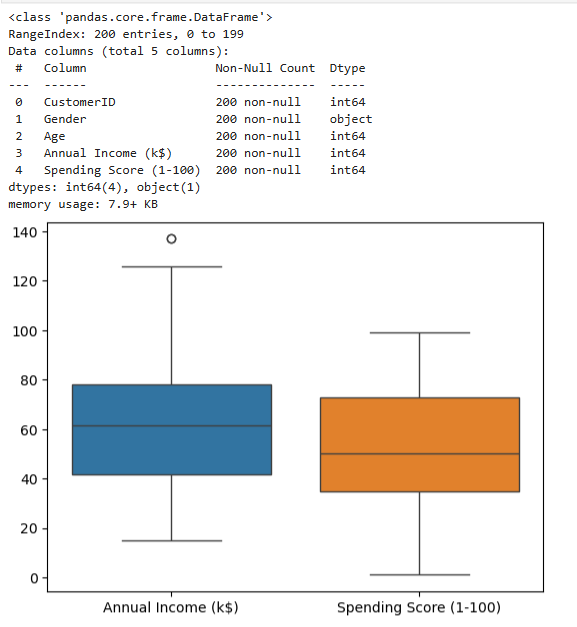
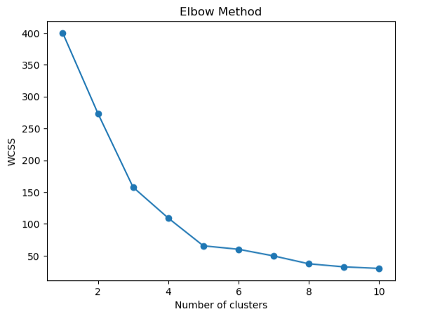
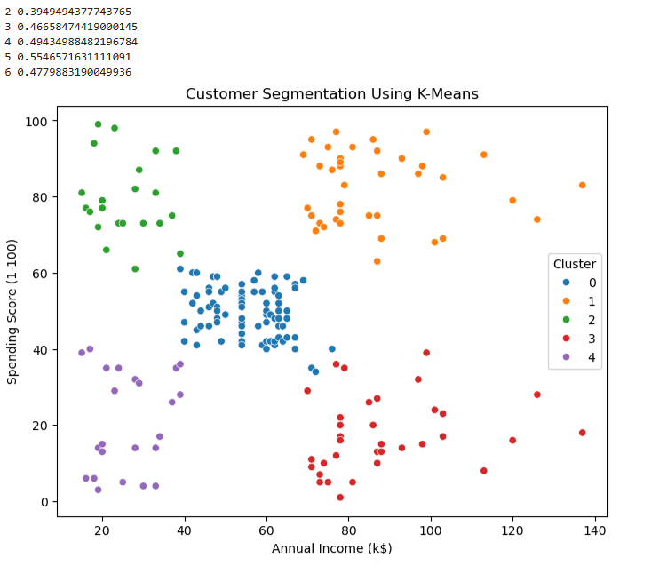

# 👥 Customer Segmentation using Machine Learning

This project was completed as part of my Machine Learning internship. The objective is to group customers into different segments based on their purchasing behavior and demographic information. By identifying similar customer groups, businesses can better understand customer preferences and create more targeted marketing strategies.

The project follows a complete machine learning workflow, including data preprocessing, exploratory data analysis (EDA), feature scaling, clustering, and visualization. It demonstrates how unsupervised learning can be used to discover meaningful patterns in customer data.

## 🚀 Features

* Data cleaning and preprocessing
* Exploratory Data Analysis (EDA)
* Feature scaling
* Customer segmentation using clustering algorithms
* Cluster visualization
* Interpretation of customer groups

## 🛠️ Technologies Used

* Python
* Pandas
* NumPy
* Matplotlib
* Seaborn
* Scikit-learn
* Jupyter Notebook

## 📂 Project Structure

```text
customer-segmentation/
│
├── data/
├── task4_customer_segmentation.ipynb
├── README.md
└── requirements.txt
```

## 📊 Workflow

1. Load and explore the customer dataset.
2. Clean and preprocess the data.
3. Scale the selected features.
4. Determine the optimal number of clusters (Elbow Method).
5. Train the clustering model.
6. Visualize and analyze the customer segments.
7. Interpret the characteristics of each cluster.

## 📊 Output

### Box Plot



### Elbow Method



### Scatter Plot



## 📈 Results

The clustering model successfully groups customers with similar characteristics into distinct segments. These segments can help businesses understand customer behavior and support data-driven decisions for personalized marketing and customer relationship management.

## 🌱 Future Improvements

* Experiment with different clustering algorithms such as DBSCAN or Hierarchical Clustering.
* Include additional customer attributes for better segmentation.
* Build an interactive dashboard using Streamlit or Dash.
* Perform cluster profiling for deeper business insights.

---

*This project was completed as part of a Machine Learning internship to strengthen my understanding of data preprocessing, unsupervised learning, clustering techniques, and customer behavior analysis using Python and Scikit-learn.*
